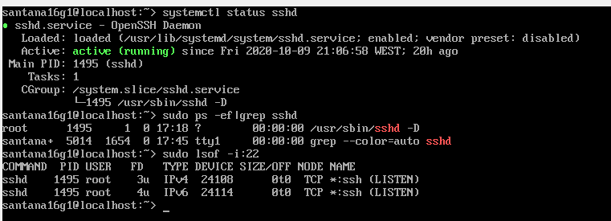
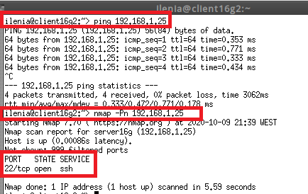
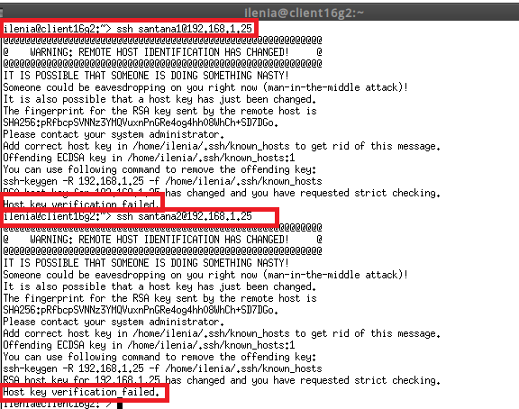

# add2021-ilenia

# Acceso remoto SSH

# 1. Preparativos

Vamos a necesitar las siguientes MVs:

| Función | Sistema Operativo     | IP        | Hostname |
| ------- |--------------------- | --------- | --------- |
| Un servidor SSH| GNU/Linux OpenSUSE (Sin entorno gráfico)| 192.168.1.25 | server16g |
| Un cliente SSH | GNU/Linux OpenSUSE | 192.168.1.30 | client16g |
| Un servidor SSH | Windows Server| 192.168.1.x | serverXXs |
| Un cliente SSH | Windows | 192.168.1.31 | clienteXXw |

## 1.1 Servidor SSH

* Añadir en `/etc/hosts` los equipos `client16g2` y `clientXXw` (Donde XX es el puesto del alumno).

Archivo de configuración del servidor.


* Para comprobar los cambios ejecutamos varios comandos. Capturar imagen:
```
ip a               # Comprobar IP, máscara y nombre interfaz de red
ip route           # Comprobar puerta de enlace
ping 8.8.4.4 -i 2  # Comprobar conectividad externa
host www.nba.com   # Comprobar el servidor DNS
ping clientXXg     # Comprobar conectividad con cliente GNU/Linux
ping clientXXw     # Comprobar conectividad con cliente Windows
lsblk              # Consultar particiones
blkid              # Consultar UUID de la instalación
```
Se han realizado todas las comprobaciones y, vemos que todo funciona correctamente.

Crear los siguientes usuarios en `server16g`:
* santana1
* santana2
* santana3
* santana4

## 1.2 Cliente GNU/Linux

* Configurar el cliente1 GNU/Linux con los siguientes valores:
    * SO OpenSUSE
    * [Configuración de las MV's](../global/configuracion/opensuse.md)
    * Nombre de equipo: `clientXXg`
* Añadir en `/etc/hosts` los equipos serverXXg, y clientXXw.
* Comprobar haciendo ping a ambos equipos.

Archivo de configuración cliente OpenSUSE.


## 1.3 Cliente Windows

* Instalar software cliente SSH en Windows. Para este ejemplo usaremos [PuTTY](http://www.putty.org/).

* Vamos a configurar el cliente2 Windows con los siguientes valores:
    * SO Windows
    * Nombre de equipo: `cliente16w`
* Añadir en `C:\Windows\System32\drivers\etc\hosts` los equipos server16 y cliente16g1.
* se ha realizado ping a ambas máquinas server16 y cliente opensuse con éxito.

Archivo de configuración de Windows cliente.


# 2 Instalación del servicio SSH

* Instalar el servicio SSH en la máquina server16g. Por comandos o entorno gráfico.


## 2.1 Comprobación

* Desde el propio servidor, verificar que el servicio está en ejecución.
    * `systemctl status sshd`, esta es la forma habitual de comprobar los servicios.
    * `ps -ef|grep sshd`, esta es otra forma de comprobarlo mirando los procesos del sistema.
    * `sudo lsof -i:22`, comprobar que el servicio está escuchando por el puerto 22.


  


## 2.2 Primera conexión SSH desde cliente GNU/Linux

* Ir al cliente `client16g2`.
* `ping server16g`, comprobar la conectividad con el servidor.
* `nmap -Pn serverXXg`, comprobar los puertos abiertos en el servidor (SSH debe estar open). Debe mostrarnos que el puerto 22 está abierto. Debe aparecer una línea como  "22/tcp open ssh". Si esto falla, debemos comprobar en el servidor la configuración del cortafuegos.



Vamos a comprobar el funcionamiento de la conexión SSH desde cada cliente usando el usuario *santana1*.
* Desde el cliente GNU/Linux nos conectamos mediante `ssh santana1@192.168.1.25`. Capturar imagen del intercambio de claves que se produce en el primer proceso de conexión SSH.


* Comprobar contenido del fichero `$HOME/.ssh/known_hosts` en el equipo cliente. OJO el prompt nos indica en qué equipo estamos.


* Es la clave de identificación de la máquina del servidor.
* A partir de ahora cuando nos conectamos sólo nos pide la contraseña:
* Una vez llegados a este punto deben de funcionar correctamente las conexiones SSH desde el cliente. Comprobarlo.


## 2.3 Primera conexión SSH desde cliente Windows

* Desde el cliente Windows nos conectamos usando `PuTTY`.
    * Capturar imagen del intercambio de claves que se produce en el primer proceso de conexión SSH.
    * Guardar la identificación del servidor.
* ¿Te suena la clave que aparece? Es la clave de identificación de la máquina del servidor.
* Una vez llegados a este punto deben de funcionar correctamente las conexiones SSH desde el cliente. Comprobarlo.
* La siguiente vez que volvamos a usar PuTTY ya no debe aparecer el mensaje de advertencia porque hemos memorizado la identificación del servidor SSH. Comprobarlo.

---
# 3. Cambiamos la identidad del servidor

¿Qué pasaría si cambiamos la identidad del servidor?
Esto es, ¿Y si cambiamos las claves del servidor? ¿Qué pasa?

* Los ficheros `ssh_host*key` y `ssh_host*key.pub`, son ficheros de clave pública/privada
que identifican a nuestro servidor frente a nuestros clientes. Confirmar que existen
el en `/etc/ssh`,:

```
david@server42g:~> cd /etc/ssh/
david@server42g:/etc/ssh> ll
total 576
-rw-r--r-- 1 root root   2375 oct  1 08:15 ldap.conf
-rw------- 1 root root 535929 oct  1 08:15 moduli
-rw-r--r-- 1 root root   2586 oct  1 08:15 ssh_config
-rw-r----- 1 root root   3776 oct  1 08:15 sshd_config
-rw------- 1 root root    668 jun 28 09:55 ssh_host_dsa_key
-rw-r--r-- 1 root root    610 jun 28 09:55 ssh_host_dsa_key.pub
-rw------- 1 root root    227 jun 28 09:55 ssh_host_ecdsa_key
-rw-r--r-- 1 root root    182 jun 28 09:55 ssh_host_ecdsa_key.pub
-rw------- 1 root root    411 jun 28 09:55 ssh_host_ed25519_key
-rw-r--r-- 1 root root    102 jun 28 09:55 ssh_host_ed25519_key.pub
-rw------- 1 root root    985 jun 28 09:55 ssh_host_key
-rw-r--r-- 1 root root    650 jun 28 09:55 ssh_host_key.pub
-rw------- 1 root root   1679 jun 28 09:55 ssh_host_rsa_key
-rw-r--r-- 1 root root    402 jun 28 09:55 ssh_host_rsa_key.pub
```

* Modificar el fichero de configuración SSH (`/etc/ssh/sshd_config`) para dejar una única línea: `HostKey /etc/ssh/ssh_host_rsa_key`. Comentar el resto de líneas con configuración HostKey.
Este parámetro define los ficheros de clave publica/privada que van a identificar a nuestro servidor. Con este cambio decimos que sólo se van a utilizar las claves del tipo RSA.

## 3.1 Regenerar certificados

Vamos a cambiar o volver a generar nuevas claves públicas/privadas que identifican nuestro servidor.
* Ir al servidor.
* Como usuario root ejecutamos: `ssh-keygen -t rsa -f /etc/ssh/ssh_host_rsa_key`. ¡OJO! No poner password al certificado.


* Reiniciar el servicio SSH: `systemctl restart sshd`.
* Comprobar que el servicio está en ejecución correctamente: `systemctl status sshd`


## 3.2 Comprobamos

* Comprobar qué sucede al volver a conectarnos desde los dos clientes, usando los  usuarios `santana2` y `santana1`. ¿Qué sucede?

cliente opensuse cliente a servidor.


Intentamos acceder con santana1 y santana2 desde cliente windows y, nos parece un mensaje de advertencia de que no está el registro del host guardado, por lo que ya tenemos que estar alerta pero, sin embargo si damos a SI, que queremos continuar nos deja acceder.


Nos avisa, pero nos deja conectarnos, por tanto no dispone de tanta seguridad como en el caso anterior.


* Para solucionarlo lo único que debemos hacer es entrar al fichero known_hosts y volver a dejarlo como estaba anteriormente.
---
# 4. Personalización del prompt Bash

* Por ejemplo, podemos añadir las siguientes líneas al fichero de configuración del `santana1` en la máquina servidor (Fichero `/home/1er-apellido-alumno1/.bashrc`)

```
# Se cambia el prompt al conectarse vía SSH

if [ -n "$SSH_CLIENT" ]; then
   PS1="AccesoRemoto_\e[32m\u@\h:\e[0m \w\a\$ "
else
   PS1="\[$(pwd)\]\u@\h:\w>"
fi
```


* Además, crear el fichero el fichero `/home/santana1/.alias`,
donde pondremos el siguiente contenido:

```
alias c='clear'
alias g='geany'
alias p='ping'
alias v='vdir -cFl'
alias s='ssh'
```


* Comprobar funcionamiento de la conexión SSH desde cada cliente.

Comprobación desde cliente OpenSUSE


Comprobación desde cliente Windows


---
# 5. Autenticación mediante claves públicas

**Explicación:**

El objetivo de este apartado es el de configurar SSH para poder acceder desde el `clientXXg` sin necesidad de escribir la clave. Usaremos un par de claves pública/privada.

Para ello, vamos a configurar la autenticación mediante clave pública para acceder con nuestro usuario personal desde el equipo cliente al servidor con el usuario `1er-apellido-alumno4`. Vamos a verlo.

**Práctica**

Capturar imágenes de los siguientes pasos:
* Vamos a la máquina `clientXXg`.
* **¡OJO! No usar el usuario root**.
* Iniciamos sesión con nuestro el usuario **nombre-alumno** de la máquina `clientXXg`.
* `ssh-keygen -t rsa` para generar un nuevo par de claves para el usuario en:
    * `/home/nombre-alumno/.ssh/id_rsa`
    * `/home/nombre-alumno/.ssh/id_rsa.pub`
* Ahora vamos a copiar la clave pública (`id_rsa.pub`), al fichero "authorized_keys" del usuario remoto *1er-apellido-alumno4* que está definido en el servidor.
    * Hay varias formas de hacerlo.
    * El modo recomendado es usando el comando `ssh-copy-id`. Ejemplo para copiar la clave pública del usuario actual al usuario remoto en la máquina remota: `ssh-copy-id 1er-apellido-alumno4@serverXXg`.

> Otra forma de hacerlo sería usando el programa de copia segura `scp`.
>
> * Comprobar que existe el directorio `/home/1er-apellido-alumno4/.ssh` en el servidor.
> * Copiamos el fichero `.ssh/id_rsa.pub` local al fichero `.ssh/authorized_keys` del usuario remoto en la máquina remota.

* Comprobar que ahora al acceder remotamente vía SSH
    * Desde `clientXXg`, NO se pide password.
    * Desde `clientXXw`, SI se pide el password.

---
# 6. Uso de SSH como túnel para X


> Enlaces de interés:
>
> * http://dustwell.com/how-x-over-ssh-really-works.html
> * http://www.vanemery.com/Linux/XoverSSH/X-over-SSH2.html

* Instalar en el servidor una aplicación de entorno gráfico (APP1) que no esté en los clientes. Por ejemplo Geany. Si estuviera en el cliente entonces buscar otra aplicación o desinstalarla en el cliente.
* Modificar servidor SSH para permitir la ejecución de aplicaciones gráficas, desde los clientes. Consultar fichero de configuración `/etc/ssh/sshd_config` (Opción `X11Forwarding yes`)
* Reiniciar el servicio SSH para que se lean los cambios de configuración.

Vamos a clientXXg.
* `zypper se APP1`,comprobar que no está instalado el programa APP1.
* Vamos a comprobar desde clientXXg, que funciona APP1(del servidor).
    * `ssh -X primer-apellido-alumno1@serverXXg`, nos conectamos de forma remota al servidor, y ahora ejecutamos APP1 de forma remota.
    * **¡OJO!** El parámetro es `-X` en mayúsculas, no minúsculas.

---
# 7. Aplicaciones Windows nativas

Podemos tener aplicaciones Windows nativas instaladas en ssh-server mediante el emulador WINE.
* Instalar emulador Wine en el `serverXXg`.
* Ahora podríamos instalar alguna aplicación (APP2) de Windows en el servidor SSH usando el emulador Wine. O podemos usar el Block de Notas que viene con Wine: wine notepad.
* Comprobar el funcionamiento de APP2 en serverXXg.
* Comprobar funcionamiento de APP2, accediendo desde clientXXg.

> En este caso hemos conseguido implementar una solución similar a RemoteApps usando SSH.

---
# 8. Restricciones de uso

Vamos a modificar los usuarios del servidor SSH para añadir algunas restricciones de uso del servicio.

## 8.1 Restricción sobre un usuario

Vamos a crear una restricción de uso del SSH para un usuario:

* En el servidor tenemos el usuario `primer-apellido2`. Desde local en el servidor podemos usar sin problemas el usuario.
* Vamos a modificar SSH de modo que al usar el usuario por SSH desde los clientes tendremos permiso denegado.

Capturar imagen de los siguientes pasos:
* Consultar/modificar fichero de configuración del servidor SSH (`/etc/ssh/sshd_config`) para restringir el acceso a determinados usuarios. Consultar las opciones `AllowUsers`, `DenyUsers` (Más información en: `man sshd_config`)
* `/usr/sbin/sshd -t; echo $?`, comprobar si la sintaxis del fichero de configuración del servicio SSH es correcta (Respuesta 0 => OK, 1 => ERROR).
* Comprobarlo la restricción al acceder desde los clientes.

## 8.2 Restricción sobre una aplicación

Vamos a crear una restricción de permisos sobre determinadas aplicaciones.

* Crear grupo `remoteapps`
* Incluir al usuario `1er-apellido-alumno4` en el grupo `remoteapps`.
* Localizar el programa APP1. Posiblemente tenga permisos 755.
* Poner al programa APP1 el grupo propietario a remoteapps.
* Poner los permisos del ejecutable de APP1 a 750. Para impedir que los usuarios que no pertenezcan al grupo puedan ejecutar el programa.
* Comprobamos el funcionamiento en el servidor en local.
* Comprobamos el funcionamiento desde el cliente en remoto (Recordar `ssh -X ...`).

---
# 9. Servidor SSH en Windows

* Configurar el servidor Windows con los siguientes valores:
    * SO Windows Server
    * Nombre de equipo: `serverXXs`
    * [Configuración de las MV's](../../global/configuracion/windows-server.md)
* Añadir en `C:\Windows\System32\drivers\etc\hosts` el equipo clientXXg y clientXXw.
* Comprobar haciendo ping a ambos equipos.
* [Instalar y configurar el servidor SSH en Windows](../../global/acceso-remoto/windows-ssh.md).
    * Elegir la opción que se quiera: OpenSSH o integrado.
    * Documentar el proceso de instalación y configuración.
* Comprobar acceso SSH desde los clientes Windows y GNU/Linux al servidor SSH Windows.
    * `netstat -n` en Windows.
    * `lsof -i -n` en GNU/Linux.

---
# ANEXO A

# Setup Passwordless SSH Login for Multiple Remote Servers Using Script

https://www.tecmint.com/passwordless-ssh-login-for-multiple-remote-servers/

## SSH cipher

https://answers.launchpad.net/ubuntu/+source/openssh/+question/669164

## Túnel Inverso SSH - mundohackers

* [Cómo hacer un túnel inverso SSH](https://mundo-hackers.weebly.com/tuacutenel-inverso-ssh.html#)
* [Un bruto con Debian: Tunel inverso SSH](https://unbrutocondebian.blogspot.com/2013/08/tunel-inverso-ssh.html?m=1)

## Trabajo colaborativo usando SSH

Podemos seguir esta recomendación para que varias personas trabajen en la misma máquina.

Supongamos que tenemos 2 máquinas llamadas MV1 y MV2.
* En MV1 instalamos el servidor SSH.
* En MV1 tenemos los usuarios usu1 y usu2.
* Desde MV2 para conectarse a MV1 debemos hacer: ssh usu2@ip-mv1. Con esto abrimos sesión en MV1 desde MV2 y podemos trabajar desde MV2.

Si queremos abrir una sesión remota pero gráfica podemos hacer en MV2:
* ssh -X usu2@ip-mv1 (Es es para abrir la sesión. Establecer contacto)
* nautilus (Con esto abrimos un explorador en MV1 pero desde MV2)
* Si tenemos el programa LibreOffice instalado en MV1, pero no en MV2... podemos conectarnos con ssh -X, y luego ejecutar... /usr/lib/libreoffice/program/soffice.bin, y ya está. Esto es trabajo remoto.

Si queremos copiar archivo de MV2 hacia MV1 hacemos:
* scp file usu2@ip-m1:/home/usu2, Ya está!
* Si además queremos iniciar una sesión sftp hacemos: sftp usu2@ip-m1
