# Instalación y configuración de conexión remota VNC
---
# 1. Windows: Slave VNC
* Configurar las máquinas virtuales según este [documento](../../global/configuracion/).
* Descargar `TightVNC`. Esta es una herramienta libre disponible para Windows.
* En el servidor VNC instalaremos `TightVNC -> Custom -> Server`. Esto es el servicio.
* Revisar la configuración del cortafuegos del servidor VNC Windows para permitir VNC.

* Primero configuramos las máquinas virtuales, necesitamos dos máquinas de Windows 10m una será la esclava y otra la Master. Las máquinas virtuales tienen las siguientes especificaciones:

      * Configuración IP máquina Slave:

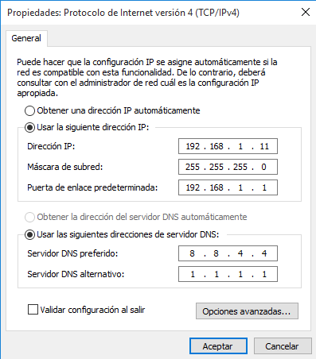

          * Configuración IP máquina MASTER:

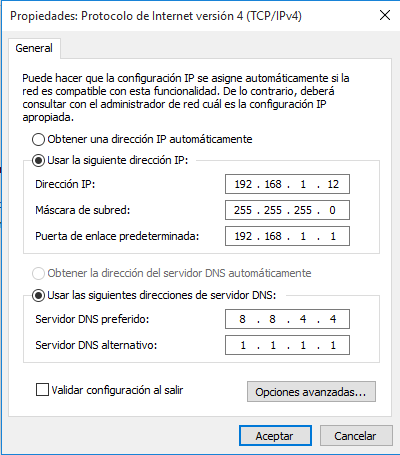

    Ahora Desde la máquina Slave vamos a descargar la herramienta 'TightVNC'

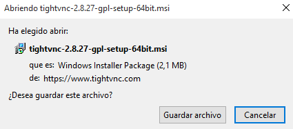

    Y ahora procederemos a la instalación del programa.

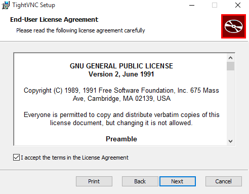

    Para la máquina Slave instalaremos la aplicación con la configuración de server.

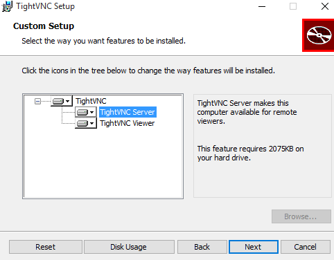

      Durante la instalación nos aparecerá una pantalla donde poner algunas medidas de
      seguridad, vamos a configurarlo para que al conectarnos desde otro equipo nos pida
      una contraseña.

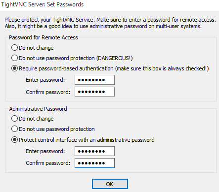

## 1.2 Ir a una máquina con GNU/Linux
* Ejecutar `nmap -Pn IP-VNC-SERVER`, desde la máquina real GNU/Linux para comprobar
que los servicios son visibles desde fuera de la máquina VNC-SERVER. Deben verse los puertos 580X, 590X, etc.
---

    Accedemos a una máquina Linux para comprobar los puertos VNC y que podamos realizar la conexión.

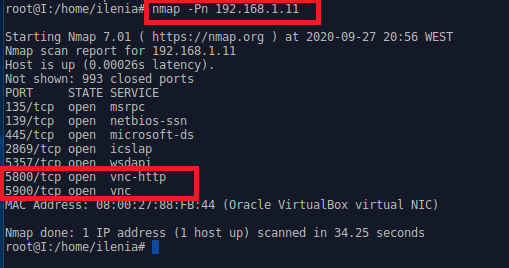

# 2 Windows: Master VNC (máquina cliente)

    En el cliente Windows instalar `TightVNC -> Custom -> Viewer`.

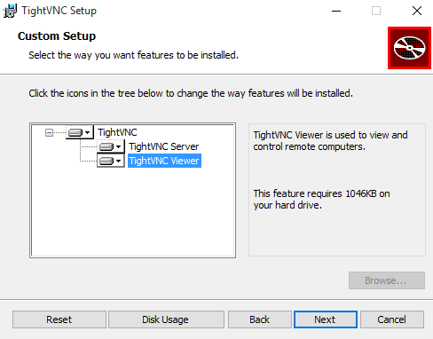

## 2.1 Comprobaciones finales

Para verificar que se han establecido las conexiones remotas:
* Conectar Window Master y GNU/Linux Mastar al Windows Slave.

    Abrimos el programa TigthVNC Viewer ya que vamos a acceder como cliente al servidor.

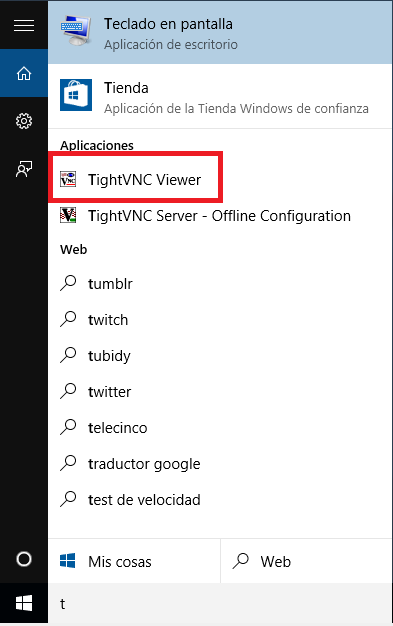

    Ahora vamos a conectarnos desde Window Master hacia el Windows Slave. Al iniciar
    el programa nos aparecerá una ventana donde pondremos la IP de la máquina Slave y
    también nos solicitará la contraseña que hemos puesto antes.

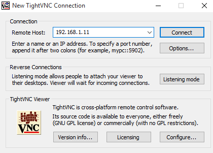

     Al darle a conectar nos solicitará la clave que hemos puesto anteriormente para la
     seguridad de las conexiones

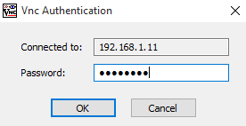

* Conectar desde GNU/Linux Master hacia el Windows Slave.

      Al darle a OK nos conectaremos con el equipo remoto del equipo Slave como se puede ver
      nos aparece su escritorio completo y podemos acceder a sus archivos.

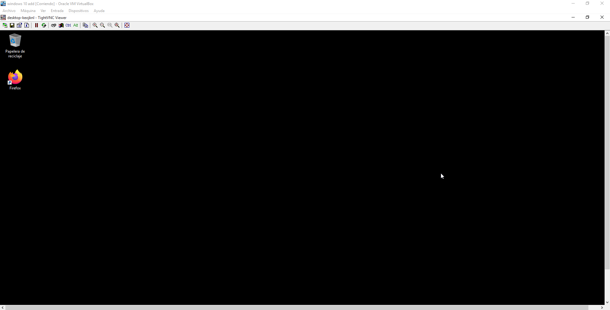

    Ir al servidor VNC y usar el comando `netstat -n` para ver las conexiones VNC con el

    cliente. Como se observa en la imagen se ha establecido la conexión remota entre el

    equipo MASTER y el SLAVE.

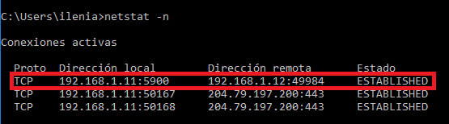
