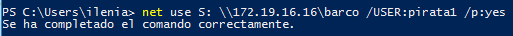
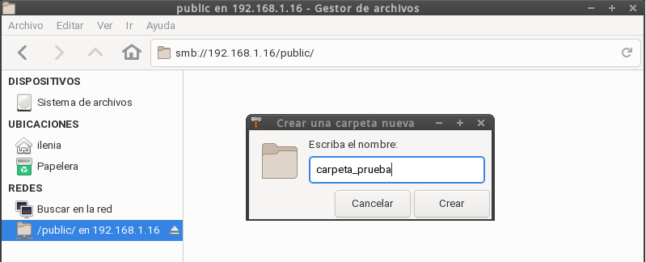
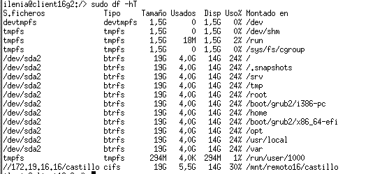

# Samba (con OpenSUSE y Windows)

## Introducción

Vamos a necesitar las siguientes máquinas:

| ID  | Función  | SSOO     | IP estática clase | ip de casa      | Hostname  |
| --- | -------- | -------- | ------------ | --------- | --------- |
| MV1 | Servidor | OpenSUSE | 172.19.16.16 |192.168.1.16 | server16g |
| MV2 | Cliente  | OpenSUSE | 172.19.16.17 | 192.168.1.17 | client16g |
| MV3 | Cliente  | Windows  | 172.19.16.18 |192.168.1.18 | client16w |

---

# 1. Servidor Samba (MV1)

## 1.1 Preparativos

* [Configurar](../../global/configuracion/opensuse.md) el servidor GNU/Linux.
* Nombre de equipo: `server16g` (Donde XX es el número del puesto de cada uno).
* Añadir en `/etc/hosts` los equipos `client16g` y `c.lient16w` (Donde XX es el número del puesto de cada uno).

## 1.2 Usuarios locales

Vamos a GNU/Linux, y creamos los siguientes grupos y usuarios locales:
* Crear los grupos `piratas`, `soldados` y `sambausers`.
* Crear el usuario `sambaguest`. Para asegurarnos que nadie puede usar `sambaguest` para
entrar en nuestra máquina mediante login, vamos a modificar este usuario y le ponemos
como shell `/bin/false`. NOTA: Podemos hacer estos cambios por entorno gráfico usando Yast, o
por comandos editando el fichero `/etc/passwd`.
* Dentro del grupo `piratas` incluir a los usuarios `pirata1`, `pirata2` y `supersamba`.
* Dentro del grupo `soldados` incluir a los usuarios `soldado1` y `soldado2` y `supersamba`.
* Dentro del grupo `sambausers`, poner a todos los usuarios `soldados`, `piratas`, `supersamba` y a `sambaguest`.

## 1.3 Crear las carpetas para los futuros recursos compartidos

* Creamos la carpeta base para los recursos de red de Samba de la siguiente forma:
    * `mkdir /srv/samba16`
    * `chmod 755 /srv/samba16`
* Vamos a crear las carpetas para los recursos compartidos de la siguiente forma:

| Recurso  | Directorio              | Usuario    | Grupo      | Permisos |
| -------- | ----------------------- | ---------- | ---------- | -------- |
| Public   | /srv/samba16/public.d   | supersamba | sambausers | 770 |
| Castillo | /srv/samba16/castillo.d | supersamba | soldados   | 770 |
| Barco    | /srv/samba16/barco.d    | supersamba | piratas    | 770 |

## 1.4 Configurar el servidor Samba

> Para instalar y configurar el servicio Samba, podemos usar comandos o el entorno gráfico.
> Como estamos en OpenSUSE vamos a usar Yast.

* `cp /etc/samba/smb.conf /etc/samba/smb.conf.bak`, hacer una copia de seguridad del fichero de configuración antes de modificarlo.

* `Yast -> Samba Server`
    * Workgroup: `curso2021`
    * Sin controlador de dominio.

* En la pestaña de `Inicio` definimos
    * Iniciar el servicio durante el arranque de la máquina.
    * Ajustes del cortafuegos -> Abrir puertos

* Compruebo que los puertos de samba están abiertos.

## 1.5 Crear los recursos compartidos de red

Vamos a configurar los recursos compartidos de red en el servidor.
Podemos hacerlo modificando el fichero de configuración o por entorno gráfico con Yast.

* Tenemos que conseguir una configuración con las secciones: `global`, `public`,
`barco`, y `castillo` como la siguiente:
    * Donde pone XX, sustituir por el número del puesto de cada uno.
    * `public`, será un recurso compartido accesible para todos los usuarios en modo lectura.
    * `barco`, recurso compartido de red de lectura/escritura para todos los piratas.
    * `castillo`, recurso compartido de red de lectura/escritura para todos los soldados.
* Podemos modificar la configuración:
    * (a) Editando directamente el ficher `/etc/samba/smb.conf` o
    * (b) `Yast -> Samba Server -> Recursos compartidos -> Configurar`.

Fichero de configuración /etc/samba/smb.conf

* `testparm`, verificar la sintaxis del fichero de configuración.

## 1.6 Usuarios Samba

Después de crear los usuarios en el sistema, hay que añadirlos a Samba.
* `smbpasswd -a USUARIO`, para crear clave Samba de USUARIO.
    * **¡OJO!: NO te saltes este paso.**
    * USUARIO son los usuarios que se conectarán a los recursos compartidos SMB/CIFS.
    * Esto hay que hacerlo para cada uno de los usuarios de Samba.
* `pdbedit -L`, para comprobar la lista de usuarios Samba.

## 1.7 Reiniciar

> Enlaces de interés:
>
> * [Demonios Samba y servicios relacionados](http://web.mit.edu/rhel-doc/4/RH-DOCS/rhel-rg-es-4/s1-samba-daemons.html)

* Ahora que hemos terminado con el servidor, hay que recargar los ficheros de configuración del servicio. Esto es, leer los cambios de configuración. Podemos hacerlo por `Yast -> Servicios`, o usar los comandos: `systemctl restart smb` y `systemctl restart nmb`.
* `sudo lsof -i`, comprobar que el servicio SMB/CIF está a la escucha.

---

# 2. Windows

* [Configurar] el cliente Windows.
 Usar nobre y la IP que hemos establecido al comienzo.* Configurar el fichero `...\etc\hosts` de Windows.
* En los clientes Windows el software necesario viene preinstalado.

## 2.1 Cliente Windows GUI

  * Tengo que destacar que he realizado una parte en casa y otra en clase realizando las pruebas para la práctica, por ello se utilizan direcciones ip diferentes pero equivalen a lo mismo es decir, 192.168.1.16 = 172.19.16.16 (ip del servidor).

Desde un cliente Windows vamos a acceder a los recursos compartidos del servidor Samba.

* Escribimos `\\ip-del-servidor-samba` y vemos lo siguiente:

* Acceder al recurso compartido con el usuario `invitado`
    * `net use` para ver las conexiones abiertas.
    * `net use * /d /y`, para borrar todas las conexión SMB/CIFS que se hadn realizado.

* Acceder al recurso compartido con el usuario `soldado`

    * `net use` para ver las conexiones abiertas.

    * `net use * /d /y`, para borrar todas las conexión SMB/CIFS que se hadn realizado.

  * Tengo que destacar que he realizado una parte en casa y otra en clase realizando las pruebas para la práctica, por ello se utilizan direcciones ip diferentes pero equivalen a lo mismo es decir, 192.168.1.16 = 172.19.16.16 (ip del servidor).

* Acceder al recurso compartido con el usuario `pirata`

* Ir al servidor Samba.
* Capturar imagen de los siguientes comandos para comprobar los resultados:
    * `smbstatus`, desde el servidor Samba.

  * `lsof -i`, desde el servidor Samba.

## 2.2 Cliente Windows comandos

* Abrir una shell de windows.
* `net use`, para consultar todas las conexiones/recursos conectados hacemos.
Con `net use /?`, podemos consultar la ayuda.
* Si hubiera alguna conexión abierta la cerramos.
    * `net use * /d /y`, para cerrar las conexiones SMB.
    * `net use` ahora vemos que NO hay conexiones establecidas.

Capturar imagen de los comandos siguientes:
* `net view \\IP-SERVIDOR-SAMBA`, para ver los recursos de esta máquina.

Montar el recurso `barco` de forma persistente.
* `net use S: \\IP-SERVIDOR-SAMBA\recurso contraseña /USER:usuario /p:yes` crear una conexión con el recurso compartido y lo monta en la unidad S. Con la opción `/p:yes` hacemos el montaje persistente. De modo que se mantiene en cada reinicio de máquina.

* `net use`, comprobamos.

* Ahora podemos entrar en la unidad S ("s:") y crear carpetas, etc.
* Capturar imagen de los siguientes comandos para comprobar los resultados:
    * `smbstatus`, desde el servidor Samba.

  * `lsof -i`, desde el servidor Samba.

---

# 3 Cliente GNU/Linux

* [Configurar](../../global/configuracion/opensuse.md) el cliente GNU/Linux.
* Usar nombre y la IP que hemos establecido al comienzo.
* Configurar el fichero `/etc/hosts` de la máquina.

## 3.1 Cliente GNU/Linux GUI

Desde en entorno gráfico, podemos comprobar el acceso a recursos compartidos SMB/CIFS.

> Algunas herramientas para acceder a recursos Samba por entorno gráfico: Yast en OpenSUSE,
Nautilus en GNOME, Konqueror en KDE, En Ubuntu podemos ir a "Lugares -> Conectar con el servidor...",
También podemos instalar "smb4k".

Ejemplo accediendo al recurso prueba del servidor Samba,
pulsamos CTRL+L y escribimos `smb://IP-SERVIDOR-SAMBA`:

> En el momento de autenticarse para acceder al recurso remoto, poner
en **Dominio** el *nombre-netbios-del-servidor-samba*.

Capturar imagen de lo siguiente:
* He realizado esta parte desde casa, ya que me la había pasado por alto, por lo que de nuevo al realizarla tengo la dirección ip de casa que es 192.168.1.16 del server.

* Probar a crear carpetas/archivos en `castillo` y en  `barco`.

* me conecto con el usuario pirata1 y, vamos a crear una carpeta.

* Vemos que se crea sin ningún problema.

 

*AHora entraré con soldado1 y, creamos una carpeta.

* Comprobar que el recurso `public` es de sólo lectura.

* Capturar imagen de los siguientes comandos para comprobar los resultados:

*Había realizado esta parte en clase, por tanto la ip cambia.

    * `smbstatus`, desde el servidor Samba.

    * `sudo lsof -i`, desde el servidor Samba.

## 3.2 Cliente GNU/Linux comandos

Capturar imagenes de todo el proceso.

> Existen comandos (`smbclient`, `mount` , `smbmount`, etc.) para ayudarnos
a acceder vía comandos al servidor Samba desde el cliente.
> Puede ser que con las nuevas actualizaciones y cambios de las distribuciones
alguno haya cambiado de nombre. ¡Ya lo veremos!

* Vamos a un equipo GNU/Linux que será nuestro cliente Samba. Desde este
equipo usaremos comandos para acceder a la carpeta compartida.

> * Probar desde una máquina Ubuntu `sudo smbtree` (REVISAR: no muestra nada)
>    * Esto muestra todos los equipos/recursos de la red SMB/CIFS.
>    * Hay que parar el cortafuegos para que funcione (`systemctl stop firewalld`), o bien
>    * ejecutar comando desde la máquina real.

* Probar desde OpenSUSE: `smbclient --list IP-SERVIDOR-SAMBA`, Muestra los recursos SMB/CIFS de un equipo.

* Ahora crearemos en local la carpeta `/mnt/remotoXX/castillo`.

* **MONTAJE MANUAL**: Con el usuario root, usamos el siguiente comando para montar un recurso compartido de Samba Server, como si fuera una carpeta más de nuestro sistema:
`mount -t cifs //172.AA.XX.31/castillo /mnt/remotoXX/castillo -o username=soldado1`

* `df -hT`, para comprobar que el recurso ha sido montado.

> * Si montamos la carpeta de `castillo`, lo que escribamos en `/mnt/remotoXX/castillo`
debe aparecer en la máquina del servidor Samba. ¡Comprobarlo!
> * Para desmontar el recurso remoto usamos el comando `umount`.

* Capturar imagen de los siguientes comandos para comprobar los resultados:
    * `smbstatus`, desde el servidor Samba.

    * `sudo lsof -i`, desde el servidor Samba.

## 3.3 Montaje automático

* Hacer una instantánea de la MV antes de seguir. Por seguridad.
* Capturar imágenes del proceso.
* Reiniciar la MV.
* `df -hT`. Los recursos ya NO están montados. El montaje anterior fue temporal.

> Antes accedimos a los recursos remotos, realizando un montaje de forma manual (comandos mount/umount). Si reiniciamos el equipo cliente, podremos ver que los montajes realizados de forma manual ya no están. Si queremos volver a acceder a los recursos remotos debemos repetir el proceso de  montaje manual, a no ser que hagamos una configuración de  montaje permanente o automática.

* Para configurar acciones de montaje automáticos cada vez que se inicie el equipo,
debemos configurar el fichero `/etc/fstab`. Veamos un ejemplo:

* El comando completo añadido al fichero es:

//192.168.1.16/castillo  /mnt/remoto16/castillo  cifs  _netdev,username=soldado1,password=ilenia84,dir_mode=0777,uia=500,gid=500    0    0

* Reiniciar el equipo y comprobar que se realiza el montaje automático al inicio.

* Incluir contenido del fichero `/etc/fstab` en la entrega.

---

# 4. Preguntas para resolver

Servicio y programas:

* ¿Por qué tenemos dos servicios (smb y nmb) para Samba?

* Samba dispone de dos demonios, por un lado el demonio smsd que es el responsable de la autenticación de usuarios, archivos compartidos, etc., por otro lado dispone del demonio nmb que es el servidor y su tarea es responder a peticiones de servicios. En los sistemas windows lo realiza el mismo servidor y, aquí hay dos demonios separados.

Usuarios:

* ¿Las claves de los usuarios en GNU/Linux deben ser las mismas que las que usa Samba?

Sería más fácil de recordar desde luego, pero por seguridad siempre es mejor tener dos claves diferentes, ya que si saben una no saben la otra, pero pueden ser las dos la misma, solo que en el sistema samba hay que proporcionarles las claves usuario por usuario.

* ¿Puedo definir un usuario en Samba llamado soldado3, y que no exista como usuario del sistema?

Si, porque es algo que va aparte.

* ¿Cómo podemos hacer que los usuarios soldado1 y soldado2 no puedan acceder al sistema pero sí al samba? (Consultar `/etc/passwd`)

Si se puede añadiendole al usuario /sbin/nologin no dejaría a los usuarios acceder al sistema mediante su usuario y clave, mientras que podría acceder a samba ya que sus claves se guardan el otro demonio diferente.

Recursos compartidos:

* Añadir el recurso `[homes]` al fichero `smb.conf` según los apuntes. ¿Qué efecto tiene?

Se crearían las normas de ese recurso compartido para el samba.

---
