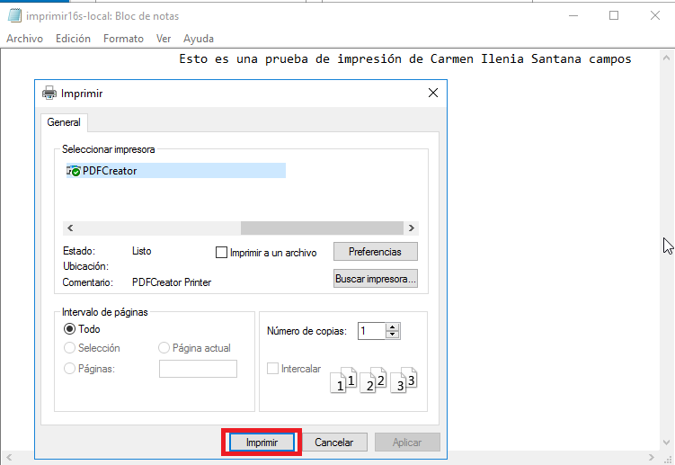
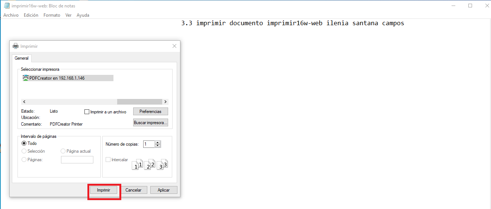
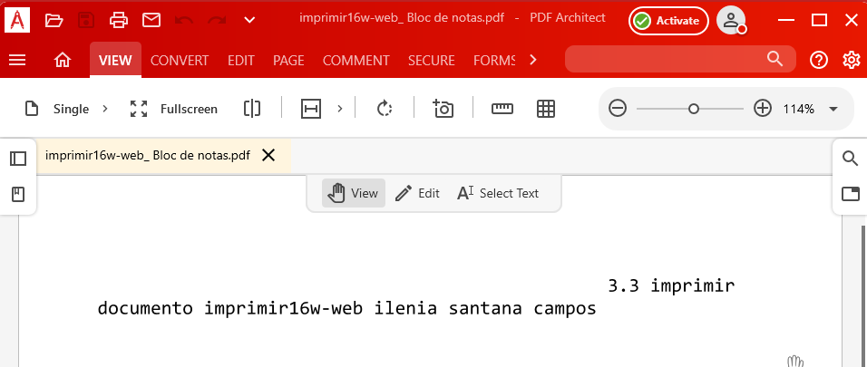

# Servidor de Impresión en Windows


# 1. Impresora compartida

## 1.1 Rol impresión

* Vamos al servidor
* Instalar rol/función de servidor de impresión. Incluir impresión por Internet.

> DUDA: Instalar rol/función de cliente de impresión por Internet.

## 1.2 Instalar impresora PDF

Vamos a conectar e instalar localmente una impresora al servidor Windows Server, de modo que estén disponibles para ser accedidas por los clientes del dominio.

En nuestro caso, dado que es posible de que no tengan una impresora física en casa y no es de mucho interés forzar la instalación de una impresora que no se tiene, vamos a instalar un programa que simule una impresora de PDF.


PDFCreator es una utilidad completamente gratuita con la que podrás crear archivos PDF desde cualquier aplicación, desde el Bloc de notas hasta Word, Excel, etc. Este programa funciona simulando ser una impresora, de esta forma, instalando PDFCreator todas tus aplicaciones con opción para imprimir te permitirán crear archivos PDF en cuestión de segundos.

* Descargar PDFCreator (URL recomendada `www.pdfforge.org/pdfcreator/download`) e instalar.
* En PDFCreator, configurar en `perfiles -> Guardar -> Automático`. Ahí establecemos la carpeta destino.

> NOTA: PDFCreator puede requerir NET FrameWork v4.

## 1.3 Probar la impresora en local

Para crear un archivo PDF no hará falta que cambies la aplicación que estés usando, simplemente ve a la opción de imprimir y selecciona "Impresora PDF", en segundos tendrás creado tu archivo PDF.

Puedes probar la nueva impresora abriendo el Bloc de notas y creando un fichero luego selecciona imprimir. Cuando finalice el proceso se abrirá un fichero PDF con el resultado de la impresión.





* Probar la impresora remota imprimiendo documento `imprimir16s-local`.


---

# 2. Compartir por red

## 2.1 En el servidor

Vamos a la MV del servidor.
* Ir al `Administrador de Impresión -> Impresoras`
* Elegir impresora PDFCreator.
    * `Botón derecho -> Propiedades -> Compartir`
    * Como nombre del recurso compartido utilizar `PDFnombrealumnoXX`.

## 2.2 Comprobar desde el cliente

Vamos al cliente:
* Buscar recursos de red del servidor. Si tarda en aparecer ponemos `\\ip-del-servidor` en la barra de navegación.


* Seleccionar impresora -> botón derecho -> conectar.


  * Ponemos usuario/clave del Windows Server.


* Ya tenemos la impresora remota configurada en el cliente.
* Probar la impresora remota imprimiendo documento `imprimir16s-remoto`.


> **INFO**: Para **buscar archivos** (Por ejemplo PDF) dentro de Windows podemos usar las funcionar de [buscar](https://www.islabit.com/10080/una-mejor-forma-de-buscar-archivos-en-windows-7.html)


---

# 3. Acceso Web

Realizaremos una configuración para habilitar el acceso web a las impresoras del dominio.

## 3.1 Instalar característica impresión WEB

* Vamos al servidor.
* Nos aseguramos de tener instalado el servicio "Impresión de Internet".

## 3.2 Configurar impresión WEB

Vamos a la MV cliente:
* Abrimos un navegador Web.
* Ponemos URL `http://<ip-del-servidor>/printers`


(o `http://<nombre-del-servidor>/printers`) para que aparezca en nuestro navegador un entorno que permite gestionar las impresoras de dicho equipo, previa autenticación como uno de los usuarios del habilitados para dicho fin (por ejemplo el "Administrador").

* Pincha en la opción propiedades y captura lo que se ve.


* Crear nueva impresora usando el URL anterior.


## 3.3 Comprobar desde el navegador

> **PDF Creator Plus** (YERAY HERNÁNDEZ HERNÁNDEZ)
>
> * [Enlace a las funcioinalidades del PDF Creator Plus](https://www.pdfforge.org/pdfcreator/plus)
> * Comprobaremos que la versión Free tiene limitaciones.

Vamos a realizar seguidamente una prueba sencilla en tu impresora de red:
* Accede a la configuración de la impresora a través del navegador.
    * Poner en `pausa` los trabajos de impresión de la impresora.


* Ir a MV cliente.
* Probar la impresora remota imprimiendo documento `imprimir16w-web`.




  * Comprobar que al estar la impresora en pausa, el trabajo aparece en cola de impresión.


* Finalmente pulsa en reanudar el trabajo para que tu documento se convierta a PDF.


* Si tenemos problemas para que aparezca el PDF en el servidor, iniciar el
programa PDFCreator y esperar un poco.



> **Si hay problemas** para acceder a la impresora de red desde el cliente Windows entonces:
>
> * Revisar la configuración de red de la máquina (Incluido la puerta de enlace)
> * Reiniciar el servidor Windows Server que contiene la impresora compartida de red.

---

# ANEXO: Colas de impresión en el servidor

```
NO HAY QUE HACER ESTE APARTADO
Sólo consultar el vídeo
```
* [Configurar cola de impresión con dos impresoras iguales](https://www.youtube.com/watch?v=mYWEEv1RdZs).
* Configurar colas/usuarios/prioridades.
