# Servicio de Directorio con comandos

## Introducción

> Enlaces de interés:
>
> * VÍDEO Teoría [¿Qué es LDAP?](http://www.youtube.com/watch?v=CXe0Wxqep_g)
>


Hay varias herramientas que implementan el servidor de directorios LDAP (389-DS, OpenLDAP, Active Directory, etc).

Según parece [Red Hat y Suse retiran su apoyo a OpenLDAP2](https://www.ostechnix.com/redhat-and-suse-announced-to-withdraw-support-for-openldap/), por este motivo, hemos decido a partir de noviembre de 2018 cambiar OpenLDAP2 por 389-DS.

En esta guía vamos a instalar y configurar del servidor LDAP con 389-DS.


# 1. Prerequisitos

> Enlaces de interés:
>
> * https://directory.fedoraproject.org/docs/389ds/howto/quickstart.html
> * https://doc.opensuse.org/documentation/leap/security/html/book-security/cha-security-ldap.html

## 1.1 Nombre de equipo FQDN

* Vamos a usar una MV OpenSUSE para montar nuestro servidor LDAP ([Configuración MV](../../global/configuracion/opensuse.md)).
* Revisar `/etc/hostname`. Nuestra máquina debe tener un FQDN=`serverXXg.curso2021`.
* Revisar `/etc/hosts`

```
127.0.0.2   serverXXg.curso2021   serverXXg
```

* Comprobar salida de: `hostname -a`, `hostname -d` y `hostname -f`.

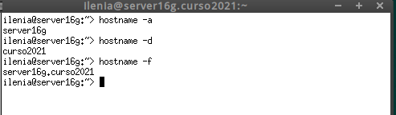


---

# 2. Instalar el Servidor LDAP

## 2.1 Instalación del paquete

* Abrir una consola como root.
* `zypper in 389-ds`, instalar el script de instalación.
* `rpm -qa | grep 389-ds`, comprobar que la versión es >= 1.4.*

## 2.2 Configurar la instancia

* Crear el fichero `/root/instance.inf` con el siguiente contenido. Este fichero sirve para configurar el servidor:


* `dscreate from-file /root/instance.inf`, creamos una nueva instancia.
* `dsctl localhost status`, comprobar el estado actual de la instancia de la base de datos LDAP

> NOTA: Si queremos eliminar una instancia de LDAP que ya tenemos creada haremos lo siguiente:
> * `dsctl localhost stop`, para parar la instancia.
> * `dsctl localhost remove --do-it`,para eliminar la instancia.

* Creamos el fichero `/root/.dsrc` con el siguiente contenido. Este fichero sirve para configurar los permisos para acceder a la base de datos como administrador:

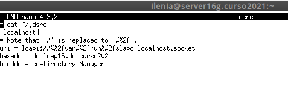


## 2.3 Comprobamos el servicio

* `systemctl status dirsrv@localhost`, comprobar si el servicio está en ejecución.
* `nmap -Pn serverXX | grep -P '389|636'`, para comprobar que el servidor LDAP es accesible desde la red. En caso contrario, comprobar cortafuegos.

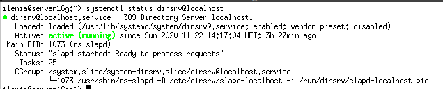


## 2.4 Comprobamos el acceso al contenido del LDAP

* `ldapsearch -b "dc=ldapXX,dc=curso2021" -x | grep dn`, muestra el contenido de nuestra base de datos LDAP. "dn" significa nombre distiguido, es un identificador que tiene cada nodo dentro del árbol LDAP.


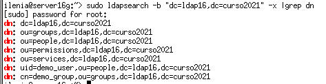


* `ldapsearch -H ldap://localhost -b "dc=ldap16,dc=curso2021" -W -D "cn=Directory Manager" | grep dn`, en este caso hacemos la consulta usando usuario/clave.


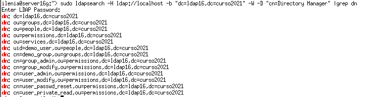


# 3. Añadir usuarios LDAP por comandos

> Enlaces de interés:
> * [Consultas a directorios LDAP utilizando ldapsearch](https://www.linuxito.com/gnu-linux/nivel-alto/1023-consultas-a-directorios-ldap-utilizando-ldapsearch)

## 3.1 Buscar Unidades Organizativas

Deberían estar creadas las OU People y Groups, es caso contrario hay que crearlas (Consultar ANEXO). Ejemplo para buscar las OU:

```
ldapsearch -H ldap://localhost:389
           -W -D "cn=Directory Manager"
           -b "dc=ldap16,dc=curso2021" "(ou=*)" | grep dn
```


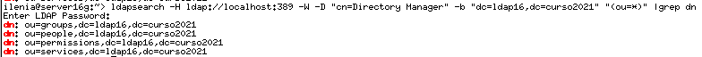


## 3.2 Agregar usuarios

> Enlaces de interés:
> * VÍDEO Teoría [Los ficheros LDIF](http://www.youtube.com/watch?v=ccFT94M-c4Y)

Uno de los usos más frecuentes para el directorio LDAP es para la administración de usuarios. Vamos a utilizar ficheros **ldif** para agregar usuarios.

* Fichero `mazinger-add.ldif` con la información para crear el usuario `mazinger` (Cambiar el valor de dn por el nuestro):

```
dn: uid=mazinger,ou=people,dc=ldapXX,dc=curso2021
uid: mazinger
cn: Mazinger Z
objectClass: account
objectClass: posixAccount
objectClass: top
objectClass: shadowAccount
userPassword: {CLEARTEXT}escribir la clave secreta
shadowLastChange: 14001
shadowMax: 99999
shadowWarning: 7
loginShell: /bin/bash
uidNumber: 2001
gidNumber: 100
homeDirectory: /home/mazinger
gecos: Mazinger Z
```


* `ldapadd -x -W -D "cn=Directory Manager" -f mazinger-add.ldif
`, escribir los datos del fichero **ldif** anterior en LDAP.

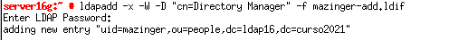


## 3.3 Comprobar el nuevo usuario

Estamos usando la clase `posixAccount`, para almacenar usuarios dentro de un directorio LDAP. Dicha clase posee el atributo `uid`. Por tanto, para listar los usuarios de un directorio, podemos filtrar por `"(uid=*)"`.

* `ldapsearch -W -D "cn=Directory Manager" -b "dc=ldapXX,dc=curso2021" "(uid=*)"`, para comprobar si se ha creado el usuario correctamente en el LDAP.


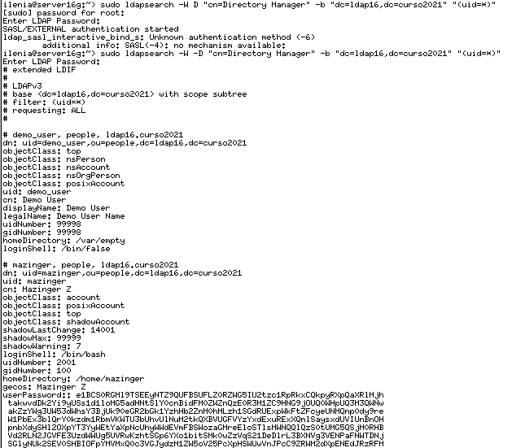
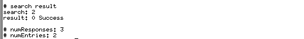


# 4. Contraseñas encriptadas

En el ejemplo anterior la clave se puso en texto plano. Cualquiera puede leerlo y no es seguro. Vamos generar valores de password encriptados.

## 4.1 TEORIA: Herramienta slappasswd

> Enlace de interés:
> * [Configurar password LDAP en MD5 o SHA-1](https://www.linuxito.com/seguridad/991-como-configurar-el-password-de-root-de-ldap-en-md5-o-sha-1)
> * [UNIX/GNU/Linux md5sum Command Examples](https://linux.101hacks.com/unix/md5sum/)´
> * [Cómo configurar el password de root de LDAP en MD5 o SHA-1](https://www.linuxito.com/seguridad/991-como-configurar-el-password-de-root-de-ldap-en-md5-o-sha-1)

* Ejecutar `zypper in openldap2`, para instalar la heramienta `slappasswd` en OpenSUSE.

La herramienta `slappasswd` provee la funcionalidad para generar un valor userPassword adecuado. Con la opción -h es posible elegir uno de los siguientes esquemas para almacenar la contraseña:
1. {CLEARTEXT} (texto plano),
1. {CRYPT} (crypt),
1. {MD5} (md5sum),
1. {SMD5} (MD5 con salt),
1. {SHA} (1ssl sha) y
1. {SSHA} (SHA-1 con salt, esquema por defecto).

**Ejemplo SHA-1**

Para generar un valor de contraseña hasheada utilizando SHA-1 con salt compatible con el formato requerido para un valor userPassword, ejecutar el siguiente comando:

```bash
$ slappasswd
New password:
Re-enter new password:
{SSHA}5uUxSgD1ssGkEUmQTBEtcqm+I1Aqsp37
```

> Con slappasswd -h MD5 genera clave encriptada MD5

También podemos usar el comando `sha512sum` para crear claves SHA512.
Escribimos la clave y pulsamos CTRL+D. Ejemplo:

```bash
$ sha512sum
profesor
59a343d6c28d4bdea88df037c0f6b47b569b8008e046fb9d90773edf3d49c34d19b6de9d00b5629d145b3b0ac12f7e1955c12954d0f4642bfade4d0adc25c482  -
```


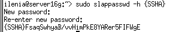


## 4.2 Agregar más usuarios con clave encriptada

> Enlace de interés:
> * [Cómo cifra GNU/Linux las contraseñas](http://www.nexolinux.com/como-cifra-linux-las-contrasenas/)

| Full name       | Login acount | uid  | Clave encriptada SHA  |
| --------------- | ------------ | ---- | --------------------- |
| Koji Kabuto     | koji         | 2002 | Contraseña encriptada |
| Boss            | boss         | 2003 | Contraseña encriptada |
| Doctor Infierno | drinfierno   | 2004 | Contraseña encriptada |


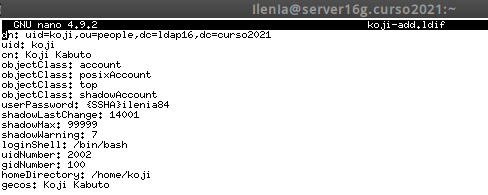


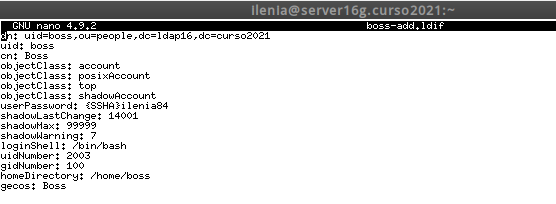


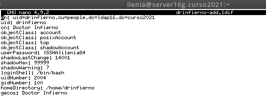


## 4.3 Comprobar los usuarios creados

* Ir a la MV cliente LDAP.
* `nmap -Pn IP-LDAP-SERVER`, comprobar que el puerto LDAP del servidor está abierto.

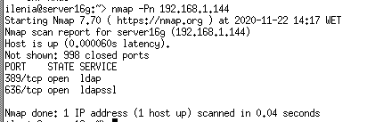


Si no aparecen los puertos abiertos, entonces revisar el cortafuegos.
* `ldpasearch -H ldap://192.168.1.144 -W -D "cn=Directory Manager" -b "dc=ldapXX,dc=curso2021" "(uid=*)" | grep dn` para consultar los usuarios LDAP que tenemos en el servicio de directorio remoto.


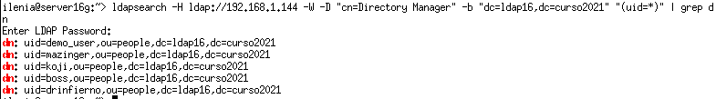
