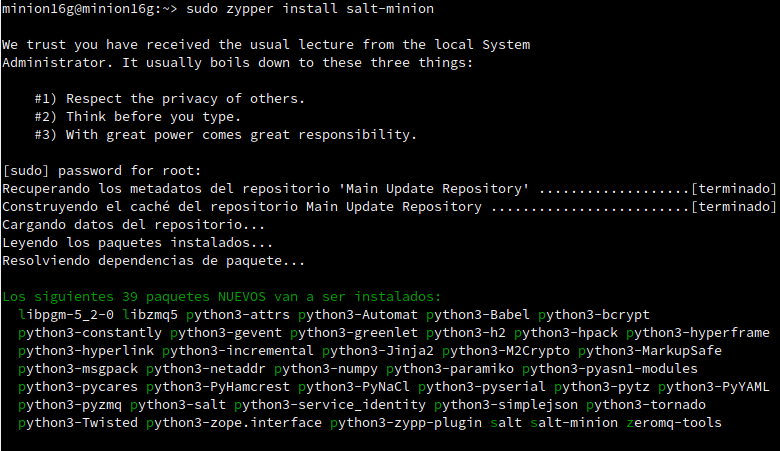
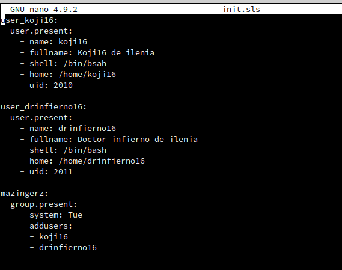
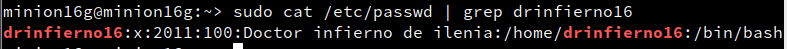

# 1. Salt-stack


## 1.1 Preparativos

| Config   | MV1           | MV2          | MV3          |
| -------- | ------------- | ------------ | ------------ |
| Hostname | masterXXg     | minionXXg    | minionXXw    |
| SO       | OpenSUSE      | OpenSUSE     | Windows      |
| IP       | 172.19.XX.31  | 172.19.XX.32 | 172.19.XX.11 |


---
# 2. Master: Instalar y configurar


* Ir a la MV1
* `zypper install salt-master`, instalar el software del Máster.


> ATENCIÓN: El fichero de configuración siguiente tiene formato YAML.
>
> 1. Los valores de clave(key) principal no tienen espacios por delante.
> 2. El resto de valores de clave(key) secundarios tendrán 2 espacios o 4 espacios por delante.
>
> Hay que cumplir estas restricciones para que el contenido del dichero sea válido.

* Modificar `/etc/salt/master` para configurar nuestro Máster con:
```
interface: 172.19.XX.31
file_roots:
  base:
    - /srv/salt
```


* `systemctl enable salt-master.service`, activiar servicio en el arranque del sistema.
* `systemctl start salt-master.service`, iniciar servicio.


* `salt-key -L`, para consultar Minions aceptados por nuestro Máster. Vemos que no hay ninguno todavía.
```
Accepted Keys:
Denied Keys:
Unaccepted Keys:
Rejected Keys:
```


---
# 3. Minion

Los Minios son los equipos que van a estar bajo el control del Máster.

## 3.1 Instalación y configuración

* `zypper install salt-minion`, instalar el software del agente (minion).





* Modificar `/etc/salt/minion` para definir quien será nuestro Máster:
```
master: 192.168.1.31
```


* `systemctl enable salt-minion.service`, activar Minion en el arranque del sistema.
* `systemctl start salt-minion.service`, iniciar el servico del Minion.


* Comprobar que  que no tenemos instalado `apache2` en el Minion.


## 3.2 Cortafuegos

Hay que asegurarse de que el cortafuegos permite las conexiones al servicio Salt. Consultar URL [Opening the Firewall up for Salt](https://docs.saltstack.com/en/latest/topics/tutorials/firewall.html)

* Ir a la MV1 Máster.
* `firewall-cmd --get-active-zones`, consultar la zona de red. El resultado será public, dmz o algún otro. Sólo debe aplicar a las zonas necesarias.
* `firewall-cmd --zone=public --add-port=4505-4506/tcp --permanent`, abrir puerto de forma permanente en la zona "public".

* `firewall-cmd --reload`, reiniciar el firewall para que los cambios surtan efecto.
(También vale con `systemctl firewalld reload`)
* `firewall-cmd --zone=public --list-all`, para consultar la configuración actual la zona `public`.


## 3.3 Aceptación desde el Master

Ir a MV1:
* `salt-key -L`, vemos que el Máster recibe petición del Minion.
```
Accepted Keys:
Denied Keys:
Unaccepted Keys:
minionXXg
Rejected Keys:
```


* `salt-key -a minionXXg`, para que el Máster acepte a dicho Minion.


* `salt-key -L`, comprobamos.


## 3.4 Comprobamos conectividad

Desde el Máster comprobamos:
1. Conectividad hacia los Minions.
```
# salt '*' test.ping
minionXXg:
    True
```


2. Versión de Salt instalada en los Minions
```
# salt '*' test.version
minionXXg:
    3000
```


> El símbolo `'*'` representa a todos los minions aceptados. Se puede especificar un minion o conjunto de minios concretos.

---
# 4. Salt States

> Enlaces de interés:
> * [Learning SaltStack - top.sls (1 of 2)](https://www.youtube.com/watch?v=UOzmExyAXOM&t=8s)
> * [Learning SaltStack - top.sls (2 of 2)](https://www.youtube.com/watch?v=1KblVBuHP2k)

## 4.1 Preparar el directorio para los estados

Vamos a crear directorios para guardar lo estados de Salt. Los estados de Salt son definiciones de cómo queremos que estén nuestras máquinas.

Ir a la MV Máster:
* Crear directorios `/srv/salt/base` y `/srv/salt/devel`.
    * base = para guardar nuestros estados.
    * devel = para desarrollo o para hacer pruebas.


* Crear archivo `/etc/salt/master.d/roots.conf` con el siguiente contenido:
```
file_roots:
  base:
    - /srv/salt/base
  devel:
    - /srv/salt/devel
```


* Reiniciar el servicio del Máster.


## 4.2 Crear un nuevo estado

Los estados de Salt se definen en ficheros SLS.
* Crear fichero `/srv/salt/base/apache/init.sls`:
```
install_apache:
  pkg.installed:
    - pkgs:
      - apache2

apache_service:
  service.running:
    - name: apache2
    - enable: True
    - require:
      - install_apache


Entendamos las definiciones:
* Nuestro nuevo estado se llama `apache` porque el directorio donde están las definiciones se llama `srv/salt/base/apache`.
* La primera línea es un identificador (Por ejemplo: `install_apache` o `apache_service`), y es un texto que ponemos nosotros libremente, de forma que nos ayude a identificar lo que vamos a definir.
* `pkg.installed`: Es una orden de salt que asegura que los paquetes estén instalados.
* `service.running`: Es una orden salt que asegura de que los servicios estén iniciados o parados.


## 4.3 Asociar Minions a estados

Ir al Máster:
* Crear `/srv/salt/base/top.sls`, donde asociamos a todos los Minions con el estado que acabamos de definir.


## 4.4 Comprobar: estados definidos

* `salt '*' state.show_states`, consultar los estados que tenemos definidos para cada Minion:


## 4.5 Aplicar el nuevo estado

Ir al Master:
* Consultar los estados en detalle y verificar que no hay errores en las definiciones.
    * `salt '*' state.show_lowstate`


    * `salt '*' state.show_highstate`,


* `salt '*' state.apply apache`, para aplicar el nuevo estado en todos los minions. OJO: Esta acción puede tardar un tiempo.


> NOTA: Con este comando `salt '*' state.highstate`, también se pueden invocar todos los estados.

---
# 5. Crear más estados

## 5.1 Crear estado "users"

> Enlaces de interés:
>
> * [Create groups](https://docs.saltstack.com/en/latest/ref/states/all/salt.states.group.html)
> * [Create users](https://docs.saltstack.com/en/master/ref/states/all/salt.states.user.html)

Vamos a crear un estado llamado `users` que nos servirá para crear un grupo y usuarios en las máquinas Minions (ver ejemplos en el ANEXO).

* Crear directorio `/srv/salt/base/users`.


* Crear fichero `/srv/salt/base/users/init.sls` con las definiciones para crear los siguiente:
    * Grupo `mazingerz`
    * Usuarios `koji16`, `drinfierno16` dentro de dicho grupo.





* Aplicar el estado.


* Comprobamos que se ha creado desde la máquina minion16





## 5.2 Crear estado "dirs"

> Enlace de inteŕes:
>
> * [Gestión de ficheros](https://docs.saltstack.com/en/getstarted/config/files.html)

* Creamos la carpeta dirs y, el archivo para el estado init.SLS


* Crear estado `dirs` para crear las carpetas `private` (700), `public` (755) y `group` (750) en el HOME del usuario `koji` (ver ejemplos en el ANEXO).


* Aplicar el estado `dirs`.


* Realizamos las comprobaciones desde el equipo minion16:


## 5.3 Ampliar estado "apache"

> Enlace de inteŕes:
>
> * [Gestión de ficheros](https://docs.saltstack.com/en/getstarted/config/files.html)
> * https://docs.saltproject.io/en/latest/ref/file_server/file_roots.html

* Crear el fichero `/srv/salt/base/files/holamundo.html`. Escribir dentro el nombre del alumno y la fecha actual.


* Incluir en el estado "apache" la creación del fichero "holamundo" en el Minion. Dicho fichero se descargará desde el servidor Salt Máster y se copiará en el Minion.

```

holamundo:
  file.managed:
    - name: /srv/www/htdocs/holamundo.html
    - source: salt://files/holamundo.html
```


* Ir al master y aplicar el estado "apache".

Ejecutamos el comando para alicar el estado en este caso:

* salt '*' state.apply apache


* Vamos a comprobar que está todo correcto y se ha instalado todo correctamente en el equipo minion16.

Se ha descargado correctamente el archivo holamundo.html en la ruta seleccionada.


Aquí comprobamos que el apache2 se ha instalado correctamente.


---
# 6. Añadir Minion de otro SO

## 6.1 Minion con Windows

* Crear MV3 con SO Windows (minionXXw)
* Instalar `salt-minion` en MV3.
* El instalador nos da la opción de iniciar el servicio del minion. Pero también podemos iniciarlo desde una consola como administrador ejecutando `sc start salt-minion`.
* Ir a MV1(Máster) y aceptar al minion.

## 6.2 Aplicar estado

* Crear un estado para el Minion de Windows únicamente.
* Aplicar estado al Minion de Windows.

---
# ANEXO

## Ejemplos

Ejemplo para crear grupo:

```
robots:
  group.present:
    - gid: 2000
```

Ejemplo para crear usuario:
```
user_mazinger:
  user.present:
    - name: mazingerXX
    - fullname: Mazinger del alumnoXX
    - shell: /bin/bash
    - home: /home/mazingerXX
    - uid: 2001
    - groups: users
```

Ejemplo para crear directorio:

```
/home/kojiXX/private:
  file.directory:
    - user:  kojiXX
    - name:  /home/kojiXX/private
    - group: mazingerz
    - mode:  700
```

Ejemplos para descargar/copiar fichero:

```
holamundo:
  file.managed:
    - name: /var/www/html/holamundo.html
    - source: salt://holamundo.html
```

```
/var/www/index.html:                        # ID declaration
  file.managed:                             # state declaration
    - source: salt://webserver/index.html   # function arg
```

```
holamundo:
  file.managed:
    - name: /tmp/holamundo.txt
    - contents: Hola Mundo!
```

## Terraform

Enlaces de interés:
* [Terraform by HashiCorp](https://www.terraform.io/): Use Infrastructure as Code to provision and manage any cloud, infrastructure, or service.
* [Why we use Terraform and not Chef, Puppet, Ansible, SaltStack, or CloudFormation](https://blog.gruntwork.io/why-we-use-terraform-and-not-chef-puppet-ansible-saltstack-or-cloudformation-7989dad2865c)
