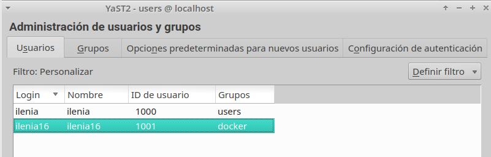
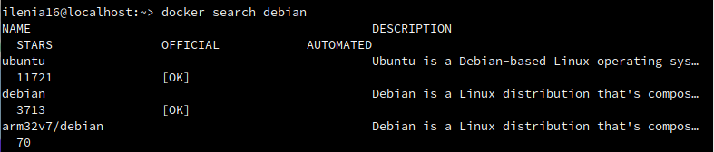
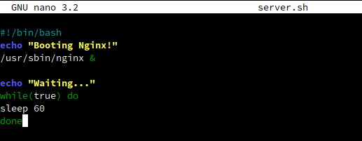
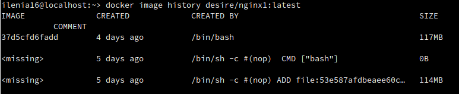
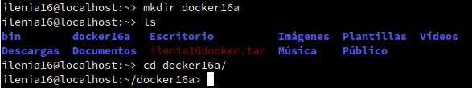
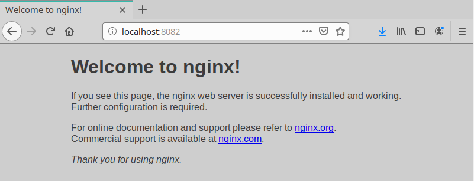
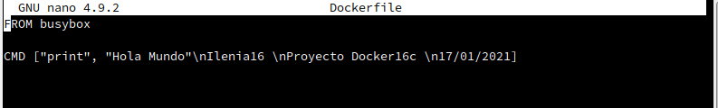

# 1. Contenedores con Docker

> Enlaces de interés
> * [Docker for beginners](http://prakhar.me/docker-curriculum/)
> * [getting-started-with-docker](http://www.linux.com/news/enterprise/systems-management/873287-getting-started-with-docker)

Es muy común que nos encontremos desarrollando una aplicación, y llegue el momento que decidamos tomar todos sus archivos y migrarlos, ya sea al ambiente de producción, de prueba, o simplemente probar su comportamiento en diferentes plataformas y servicios.

Para situaciones de este estilo existen herramientas que, entre otras cosas, nos facilitan el embalaje y despliegue de la aplicación, es aquí donde entra en juego los contenedores (Por ejemplo Docker o Podman).

Esta herramienta nos permite crear "contenedores", que son aplicaciones empaquetadas auto-suficientes, muy livianas, capaces de funcionar en prácticamente cualquier ambiente, ya que tiene su propio sistema de archivos, librerías, terminal, etc.

Docker es una tecnología contenedor de aplicaciones construida sobre LXC.


## 1.1 Instalación

> Enlaces de interés:
> * [EN - Docker installation on SUSE](https://docs.docker.com/engine/installation/linux/SUSE)
> * [ES - Curso de Docker en vídeos](jgaitpro.com/cursos/docker/)

Ejecutar como superusuario:
* `zypper in docker`, instalar docker en OpenSUSE (`apt install docker` en Debian/Ubuntu).


* `systemctl start docker`, iniciar el servicio. NOTA: El comando `docker daemon` hace el mismo efecto.


* `systemctl enable docker`, si queremos que el servicio de inicie automáticamente al encender la máquina.


* `cat /proc/sys/net/ipv4/ip_forward`, consultar el estado de IP_FORWARD. Debe estar activo=1.  


## 1.2 Primera prueba

* **IMPORTANTE**: Incluir a nuestro usuario (nombre-del-alumno) como miembro del grupo `docker`. Solamente los usuarios dentro del grupo `docker` tendrán permiso para usarlo.





* Iniciar sesión como usuario normal.
* `docker version`, comprobamos que se muestra la información de las versiones cliente y servidor.


* **OJO**: A partir de ahora todo lo haremos con nuestro usuario, sin usar `sudo`.
* `docker run hello-world`, este comando hace lo siguiente:
    * Descarga una imagen "hello-world"
    * Crea un contenedor y
    * ejecuta la aplicación que hay dentro.


* `docker images`, ahora vemos la nueva imagen "hello-world" descargada en nuestro equipo local.


* `docker ps -a`, vemos que hay un contenedor en estado 'Exited'.
* `docker stop IDContainer`, parar el conteneder.
* `docker rm IDContainer`, eliminar el contenedor.


## 1.3 Sólo para LEER

Veamos un poco de teoría.

Tabla de referencia para no perderse:

| Software   | Base   | Sirve para crear   | Aplicaciones |
| ---------- | ------ | ------------------ | ------------ |
| VirtualBox | ISO    | Máquinas virtuales | N |
| Vagrant    | Box    | Máquinas virtuales | N |
| Docker     | Imagen | Contenedores       | 1 |


Comandos útiles de Docker:

| Comando                   | Descripción           |
| ------------------------- | --------------------- |
| docker stop CONTAINERID   | Parar un contenedor   |
| docker start CONTAINERID  | Iniciar un contenedor |
| docker attach CONTAINERID | Conectar el terminal actual con el contenedor |
| docker ps                 | mostrar los contenedores en ejecución |
| docker ps -a              | mostrar todos los contenedores (en ejecución o no) |
| docker rm CONTAINERID     | Eliminar un contenedor |
| docker rmi IMAGENAME      | Eliminar una imagen    |

## 1.4 Alias

Para ayudarnos a trabajar de forma más rápida con la línea de comandos podemos agregar los siguientes alias al fichero `/home/ilenia/.alias`:

```
alias di='docker images'
alias dp='docker ps'
alias dpa='docker ps -a'
alias drm='docker rm '
alias drmi='docker rmi '
alias ds='docker stop '
```

# 2. Creación manual de nuestra imagen

Nuestro SO base es OpenSUSE, pero vamos a crear un contenedor Debian,
y dentro instalaremos Nginx.

## 2.1 Crear un contenedor manualmente

**Descargar una imagen**
* `docker search debian`, buscamos en los repositorios de Docker Hub contenedores con la etiqueta `debian`.





* `docker pull debian`, descargamos una imagen en local.


* `docker images`, comprobamos.


**Crear un contenedor**: Vamos a crear un contenedor con nombre `app1debian` a partir de la imagen `debian`, y ejecutaremos el programa `/bin/bash` dentro del contendor:
* `docker run --name=app1debian -i -t debian /bin/bash`


## 2.2 Personalizar el contenedor

Ahora estamos dentro del contenedor, y vamos a personalizarlo a nuestro gusto:

**Instalar aplicaciones dentro del contenedor**


root@IDContenedor:/# cat /etc/motd            # Comprobamos que estamos en Debian

root@IDContenedor:/# apt-get update


root@IDContenedor:/# apt-get install -y nginx # Instalamos nginx en el contenedor


root@IDContenedor:/# apt-get install -y vim   # Instalamos editor vi en el contenedor


**Crear un fichero HTML** `holamundo1.html`.

```
root@IDContenedor:/# echo "<p>Hola ilenia</p>" > /var/www/html/holamundo1.html
```


**Crear un script** `/root/server.sh` con el siguiente contenido:

```
#!/bin/bash
echo "Booting Nginx!"
/usr/sbin/nginx &

echo "Waiting..."
while(true) do
  sleep 60
done
```





**Recordatorio:**
* Hay que poner permisos de ejecución al script para que se pueda ejecutar (`chmod +x /root/server.sh`).


* La primera línea de un script, siempre debe comenzar por `#!/`, sin espacios.
* Este script inicia el programa/servicio y entra en un bucle, para mantener el contenedor activo y que no se cierre al terminar la aplicación.

## 2.3 Crear una imagen a partir del contenedor

Ya tenemos nuestro contenedor auto-suficiente de Nginx, ahora debemos vamos a crear una nueva imagen que incluya los cambios que hemos hecho.

* Abrir otra ventana de terminal.
* `docker commit app1debian ilenia/nginx1`, a partir del CONTAINERID vamos a crear la nueva imagen que se llamará "nombre-del-alumno/nginx1".

* `docker images`, comprobamos que se ha creado la nueva imagen.


> NOTA:
>
> * Los estándares de Docker estipulan que los nombres de las imágenes deben seguir el formato `nombreusuario/nombreimagen`.
> * Todo cambio realizado que se acompañe de un commit a la imagen, se perderá en cuanto se cierre el contenedor.

* Ahora podemos parar el contenedor, `docker stop app1debian` y
* Eliminar el contenedor, `docker rm app1debian`.


# 3. Crear contenedor a partir de nuestra imagen

## 3.1 Crear contenedor con Nginx

Ya tenemos una imagen "dvarrui/nginx" con Nginx instalado.
* `docker run --name=app2nginx1 -p 80 -t ilenia/nginx1 /root/server.sh`, iniciar el contenedor a partir de la imagen anterior.


> El argumento `-p 80` le indica a Docker que debe mapear el puerto especificado del contenedor, en nuestro caso el puerto 80 es el puerto por defecto sobre el cual se levanta Nginx.

## 3.2 Comprobamos

* Abrimos una nueva terminal.
* `docker ps`, nos muestra los contenedores en ejecución. Podemos apreciar que la última columna nos indica que el puerto 80 del contenedor está redireccionado a un puerto local `0.0.0.0.:PORT -> 80/tcp`.


* Abrir navegador web y poner URL `0.0.0.0.:PORT`. De esta forma nos conectaremos con el servidor Nginx que se está ejecutando dentro del contenedor.


* Comprobar el acceso a `holamundo1.html`.


* Paramos el contenedor `app2nginx1` y lo eliminamos.


Como ya tenemos una imagen docker con Nginx (Servidor Web), podremos crear nuevos contenedores cuando lo necesitemos.

## 3.3 Migrar la imagen a otra máquina

¿Cómo puedo llevar los contenedores Docker a un nuevo servidor?

> Enlaces de interés
>
> * https://www.odooargentina.com/forum/ayuda-1/question/migrar-todo-a-otro-servidor-imagenes-docker-397
> * http://linoxide.com/linux-how-to/backup-restore-migrate-containers-docker/

**Exportar** imagen Docker a fichero tar:
* `docker save -o alumno16docker.tar ilenia/nginx1`, guardamos la imagen
"nombre-alumno/nginx1" en un fichero tar.


Intercambiar nuestra imagen exportada con la de un compañero de clase.

**Importar** imagen Docker desde fichero:
* Coger la imagen de un compañero de clase.
* Nos llevamos el tar a otra máquina con docker instalado, y restauramos.
* `docker load -i alumno16docker.tar`, cargamos la imagen docker a partir del fichero tar. Cuando se importa una imagen se muestra en pantalla las capas que tiene. Las capas las veremos en un momento.


* `docker images`, comprobamos que la nueva imagen está disponible.


* Probar a crear un contenedor (`app3alumno`), a partir de la nueva imagen.


## 3.4 Capas

**Teoría sobre las capas**. Las imágenes de docker están creadas a partir de capas que van definidas en el fichero Dockerfile. Una de las ventajas de este sistema es que esas capas son cacheadas y se pueden compartir entre distintas imágenes, esto es que si por ejemplo la creación de nuestra imagen consta de 10 capas, y modificamos una de esas capas, a la hora de volver a construir la imagen solo se debe ejecutar esta nueva capa, el resto permanecen igual.

Estas capas a parte de ahorrarnos peticiones de red al bajarnos una nueva versión de una imagen también ahorra espacio en disco, ya que las capas que no se hayan cambiado entre versiones no se descargarán.

* `docker image history nombre_imagen:version`, para consultar las capas de la imagen del compañero.





# 4. Dockerfile

Ahora vamos a conseguir el mismo resultado del apartado anterior, pero
usando un fichero de configuración. Esto es, vamos a crear un contenedor a partir de un fichero `Dockerfile`.

## 4.1 Preparar ficheros

* Crear directorio `/home/ilenia/docker16a`.





* Entrar el directorio anterior.
* Crear fichero `holamundo2.html` con:
    * Proyecto: docker16a
    * Autor: Nombre del alumno
    * Fecha: Fecha actual


* Crear el fichero `Dockerfile` con el siguiente contenido:

```
FROM debian

MAINTAINER nombre-del-alumno16 1.0

RUN apt-get update
RUN apt-get install -y apt-utils
RUN apt-get install -y nginx

COPY holamundo2.html /var/www/html
RUN chmod 666 /var/www/html/holamundo2.html

EXPOSE 80

CMD ["/usr/sbin/nginx", "-g", "daemon off;"]
```


> * Enlace de interés: https://docs.nginx.com/nginx/admin-guide/installing-nginx/installing-nginx-docker/


## 4.2 Crear imagen a partir del `Dockerfile`

El fichero Dockerfile contiene toda la información necesaria para construir el contenedor, veamos:

* `cd docker16a`, entramos al directorio con el Dockerfile.
* `docker build -t ilenia/nginx2 .`, construye una nueva imagen a partir del Dockerfile. OJO: el punto final es necesario.


* `docker images`, ahora debe aparecer nuestra nueva imagen.


## 4.3 Crear contenedor y comprobar

A continuación vamos a crear un contenedor con el nombre `app4nginx2`, a partir de la imagen `nombre-alumno/nginx2`. Probaremos con:

```
docker run --name=app4nginx2 -p 8082:80 -t ilenia/nginx2
```


Desde otra terminal:
* `docker ps`, para comprobar que el contenedor está en ejecución y en escucha por el puerto deseado.


* Comprobar en el navegador:
    * URL `http://localhost:PORTNUMBER`





    * URL `http://localhost:PORTNUMBER/holamundo2.html`


Ahora que sabemos usar los ficheros Dockerfile, nos damos cuenta que es más sencillo usar estos ficheros para intercambiar con nuestros compañeros que las herramientas de exportar/importar que usamos anteriormente.

## 4.4 Usar imágenes ya creadas

El ejemplo anterior donde creábamos una imagen Docker con Nginx se puede simplificar aún más aprovechando imágenes oficiales que ya existen.

> Enlace de interés:
> * [nginx - Docker Official Images] https://hub.docker.com/_/nginx

* Crea el directorio `docker16b`. Entrar al directorio.


* Crear fichero `holamundo3.html` con:
    * Proyecto: docker16b
    * Autor: Nombre del alumno
    * Fecha: Fecha actual


* Crea el siguiente `Dockerfile`

```
FROM nginx

COPY holamundo3.html /usr/share/nginx/html
RUN chmod 666 /usr/share/nginx/html/holamundo3.html
```


* Poner el el directorio `docker16b` los ficheros que se requieran para construir el contenedor.
* `docker build -t ilenia/nginx3 .`, crear la imagen.


* `docker run --name=app5nginx3 -d -p 8083:80 ilenia/nginx3`, crear contenedor.


* Comprobar el acceso a "holamundo3.html".


# 5. Docker Hub

Ahora vamos a crear un contenedor "hola mundo" y subirlo a Docker Hub.

* Crear carpeta `docker16c`. Entrar en la carpeta.

* Crear fichero Dockerfile de modo que al ejecutar este comando `docker run ilenia/holamundo` se mostrará en pantalla el mensaje siguiente:
```
Hola Mundo!
ilenia16
Proyecto docker16c
Fecha actual
```




> NOTA: Usaremos la imagen base `busybox` y la instrucción RUN o un script para mostrar mensajes por pantalla.

* Registrarse en Docker Hub.
* `docker login -u ileniasantana(usuario docker)`, para abrir la conexión.


* `docker tag ilenia/holamundo:latest ileniasantana(USUARIO-DOCKER)/holamundo:version1`, etiquetamos la imagen con "version1".
* `docker push ileniasantana (USUARIO-DOCKER)/holamundo:version1`, para subir la imagen (version1) a los repositorios de Docker.


# 6. Limpiar contenedores e imágenes

Cuando terminamos con los contenedores, y ya no lo necesitamos, es buena idea pararlos y/o destruirlos.

* `docker ps -a`, identificar todos los contenedores que tenemos.
* `docker stop ...`, parar todos los contenedores.
* `docker rm ...`, eliminar los contenedores.

Hacemos lo mismo con las imágenes. Como ya no las necesitamos las eliminamos:

* `docker images`, identificar todas las imágenes.
* `docker rmi ...`, eliminar las imágenes.
